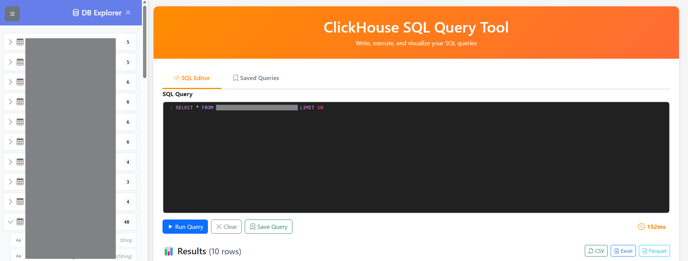

# ClickHouse SQL Query Tool

Modern web-based SQL query tool for ClickHouse with responsive UI and data export capabilities.



## ✨ Features

- **Web UI**: Modern Bootstrap 5 design with orange theme
- **SQL Editor**: CodeMirror-powered editor with syntax highlighting, auto-completion, and line numbers
- **Saved Queries**: Save, load, and manage your favorite queries with metadata tracking
- **Execution Timer**: Real-time query execution time tracking
- **Data Export**: Download results as CSV, Excel, or Parquet formats
- **Responsive Design**: Fully responsive layout that works on desktop, tablet, and mobile devices
- **TOML Configuration**: Dynamic database configuration via TOML files
- **Real-time Feedback**: Instant query execution with loading indicators and progress tracking
- **Query Management**: Organize queries with names, creation dates, and last-used timestamps

## 🚀 Quick Start

### Setup Configuration

Copy the example config file:

```bash
cp config.toml.example config.toml
```

Edit `config.toml` with your database credentials:

```toml
[database]
host = ""
port = 
username = "default"
password = "your-password"
database = ""
```

## 🌐 Web Interface

### Start Web Server

```bash
uv run uvicorn app:app --reload --host 0.0.0.0 --port 8000
```

Or:

```bash
python app.py
```

Access at: **http://localhost:8000**

### Web Features

#### SQL Editor Tab
- **SQL Editor**: Syntax highlighting, line numbers, auto-close brackets, and code completion
- **Keyboard Shortcuts**: `Ctrl+Enter` or `Cmd+Enter` to run query
- **Execution Timer**: Real-time timer showing query duration
- **Loading Indicator**: Shows during query execution with live timer
- **Results Table**: Scrollable table with sticky header and hover effects
- **Export Options**: Download results as CSV, Excel, or Parquet
- **Save Queries**: Bookmark queries for later use with custom names

#### Saved Queries Tab
- **List Card Layout**: View all saved queries in a clean vertical list with pagination (10 queries per page)
- **Query Actions**: Four action buttons for each query:
  - 👁️ **View**: Open modal to view query details including name, SQL, and metadata
  - ▶️ **Load**: Load query into SQL Editor and execute immediately
  - ✏️ **Edit**: Load query into SQL Editor for modification with update capability
  - 🗑️ **Delete**: Remove query with confirmation dialog
- **Pagination**: Navigate through saved queries with page numbers and previous/next buttons
- **Metadata Tracking**: Display created time and last used timestamps for each query
- **Quick Refresh**: Reload query list with one click

## 📁 Project Structure

```
clickhouse-starter/
├── config.toml              # Database & saved queries config (git ignored)
├── config.toml.example      # Config template
├── app.py                   # Web server (FastAPI)
├── templates/
│   └── index.html           # Web interface (Bootstrap 5)
├── static/
│   ├── app.js               # Frontend JavaScript logic
│   └── style.css            # Custom CSS styling
├── modules/
│   ├── __init__.py
│   ├── config.py            # TOML config reader
│   ├── database.py          # ClickHouse connection
│   ├── query.py             # Query executor
│   └── formatter.py         # Data formatter (passthrough)
├── pyproject.toml           # Project dependencies
├── requirements.txt         # Pip requirements
├── screenshoot.png          # Application screenshot
└── .gitignore              # Git ignore rules
```

## 🔌 Architecture

```
Browser → app.py (FastAPI) → modules → ClickHouse
```

## ⚙️ Configuration

### Database Settings

| Parameter  | Description     | Example         |
|------------|-----------------|-----------------|
| host       | Server address  | 192.168.1.10    |
| port       | ClickHouse port | 12345           |
| username   | Database user   | default         |
| password   | User password   | your-password   |
| database   | Database name   | db_example      |

### Saved Queries

Queries are automatically saved to `config.toml` under the `[queries]` section:

```toml
[queries.describe_students]
name = "Describe Students"
sql = "DESCRIBE TABLE db_example.students"
created_at = "2026-04-16T13:00:00"
last_used = "2026-04-16T13:30:00"
```

- **Name**: Display name for the query
- **SQL**: The SQL query statement
- **created_at**: Timestamp when query was saved
- **last_used**: Timestamp when query was last loaded

## 📦 Installation

```bash
uv sync
```

Or with pip:

```bash
pip install -r requirements.txt
```

### Dependencies

- **clickhouse-connect**: ClickHouse database driver
- **pandas**: Data manipulation and analysis
- **fastapi**: Web framework
- **uvicorn**: ASGI server
- **tomlkit**: TOML file manipulation
- **pyarrow**: Parquet file support

## 🔒 Security

- `config.toml` is gitignored (contains credentials)
- Use `config.toml.example` as template
- Never commit sensitive data

## 📖 Usage Guide

### Running Queries
1. Write or paste SQL query in the editor
2. Click **Run Query** button or press `Ctrl+Enter`
3. Watch the real-time timer during execution
4. View results in the table below
5. Download as CSV, Excel, or Parquet if needed

### Saving Queries
1. Write a query you want to save
2. Click **Save Query** button (green)
3. Enter a memorable name for the query
4. Click **Save** to store in config.toml

### Loading Saved Queries
1. Switch to **Saved Queries** tab
2. Browse your saved queries using pagination if needed
3. Choose an action:
   - Click **▶️ Load** to load query into editor and run it
   - Click **✏️ Edit** to load query into editor for modification
   - Click **👁️ View** to see full query details in a modal
4. After loading/editing, click **Run Query** to execute

### Managing Queries
- **Refresh**: Click refresh button to reload query list
- **View**: Click eye icon to view query details in modal (name, SQL, created/last used)
- **Load**: Click play icon to load and execute query in SQL Editor
- **Edit**: Click pencil icon to edit query in SQL Editor, then click **Update Query** to save changes
- **Delete**: Click trash icon to remove a query (with confirmation)
- **Pagination**: Use page numbers or previous/next buttons to navigate through queries

## ✨ Code Quality

### Best Practices
- ✅ Modular architecture with separation of concerns
- ✅ Single responsibility per module
- ✅ Type hints and comprehensive docstrings
- ✅ Proper error handling

### Clean Code
- ❌ No duplicate code
- ❌ No unused imports
- ❌ No hardcoded values (all in config.toml)
- ❌ No unnecessary files

### Git Ignore Rules
- `__pycache__/` - Python cache
- `config.toml` - Sensitive credentials
- `output/*.csv` - Generated files
- IDE & OS files

## 📝 License

Internal use only.